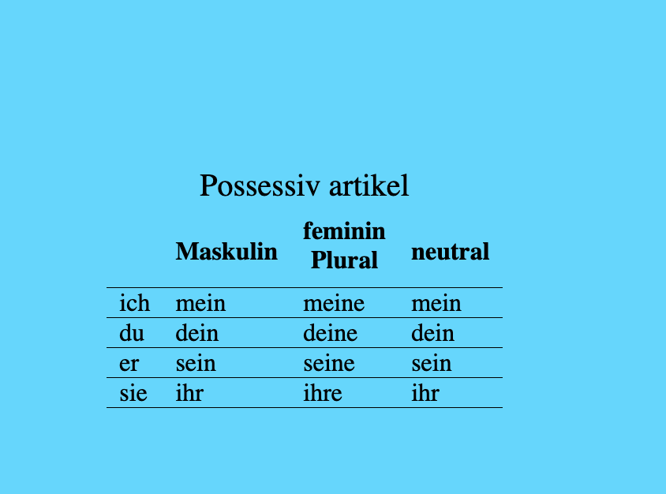

# loading screen

A chrome extension that display new information on every tab!

So far it only has the fixed german dataSet but the next goal is probably do some notion integration.

Think of this as the loading screens that appears before a game starts, only it is information you want to learn while you open your 10th mdn tab for the day.



""

## Development

Run

```sh
npm run dev
```

Then go to http://127.0.0.1:5173/src/modules/newTab/index.html to check a new tab or http://127.0.0.1:5173/src/modules/options/index.html to check options.

## Loading as unpublished extension

Build

```sh
npm run build
```

Then go to chrome extensions [chrome://extensions/](chrome://extensions/) and open on developer mode.

For more info check the [tutorial](https://developer.chrome.com/docs/extensions/mv2/getstarted/#manifest).

## Tech aspects

This is a series of react apps that compile to a chrome extension through [vite](https://vitejs.dev/).
It has Typescript, Jest and react testing library for testing
